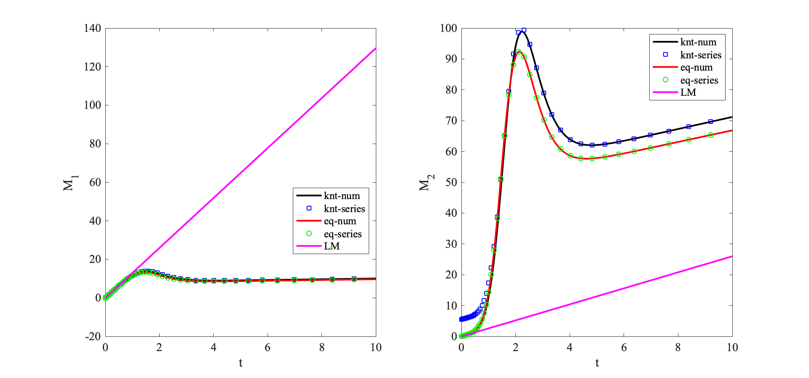

# Sample Matlab Code

## Description of code
This sample file computes the normalized global moments (zeroth $M_0$, first $M_1$, second $M_2$) of a reactive solute in Poiseuille flow between plates with surface adsorption. Three different types of surface adsorption model are implemented:
* linear kinetic model: both adsorption and desorption occur simultaneously and described using a kinetic rate;
* linear equilibrium model: both adsorption and desorption occur simultaneously and described using a equilibrium constant;
* adsorption-only model ([Lungu-Moffatt model]((https://link.springer.com/article/10.1007/BF00042550))): kinetic adsorption without desorption and described only by adsorption rate.

The global moments give the fraction of solute in the fluid (), the centre of mass ($M_1$) and the variance of the solute distribution in the fluid ($M_2$). The corresponding dimensionless transport velocity and longitudinal dispersion coefficient of the solute can be calculated by
$$
v=\frac{\mathrm{d}M_1}{\mathrm{d} t} \quad \text{and} \quad D_L = \frac{1}{2} \frac{\mathrm{d}M_2}{\mathrm{d}t}.
$$
For more details, please refer to [Zhang L., Hesse M. and Wang M. Journal of Fluid Mechanics, 2017, 828: 733-752](https://www.cambridge.org/core/journals/journal-of-fluid-mechanics/article/transient-solute-transport-with-sorption-in-poiseuille-flow/A71BED73D16A236D02F06E19FF54DF02).

## Note
Some of the functions require expressions from the mupad file (\*.mn). Specifically,
* For method = 'num', `moment_knt.mn` should be open and evaluated.
* For method = 'series' and num_k >=2, `Res_limit.mn` should be open and evaluated.
* For method = 'num', `moment_eq.mn` should be open and evaluated.
* For method = 'series' and num_k >=2, `Res_limit_eq.mn` should be open and evaluated.

## File Structure
`Moment_Analysis.m`: main file, calculating and plotting the global moments using different methods and models.

`./functions` : folder for all the basic functions used in evaluating the moments
  * `moment_eq.m`: returns normalized global moments for equilibrium adsorption model using numerical inverse Laplace transform (`method = num`), or truncated series solution derived by residue theorem (`method = series`).
  * `moment_knt.m`: returns normalized global moments for kinetic adsorption model using numerical inverse Laplace transform (`method = num`), or truncated series solution derived by residue theorem (`method = series`).
  * `moment_LM.m`: returns normalized global moments for adsorption-only model using analytical solution from [Lungu, E. M. \& Moffatt, H. K. Journal of Engineering Mathematics, 1982, 16 (2): 121–136.](https://link.springer.com/article/10.1007/BF00042550).
  * `root_tr_eq.m`: returns the roots of the transcendental equation for series solution of the equilibrium adsorption model
  * `root_tr_knt.m`: returns the roots of the transcendental equation for series solution of kinetic adsorption model
  * `talbot_inversion.m`: returns an approximation to the inverse Laplace transform of function using Talbot's method. From [Mathworks file exchange](https://www.mathworks.com/matlabcentral/fileexchange/39035-numerical-inverse-laplace-transform).

`./mupad` : folder for mupad files. These files derive analytical solutions using symbolic math, and can be used to evaluate some functions.
  * `moment_eq.mn`: derive inverse Laplace form of moments for equilibrium adsorption model
  * `moment_knt.mn`: derive inverse Laplace form of moments for kinetic adsorption model
  * `Res_limit_eq.mn`: derive truncated series solution of moments using residue theorem for equilibrium adsorption model
  * `Res_limit_knt.mn`: derive truncated series solution of moments using residue theorem for kinetic adsorption model

`./figure` : folder for saved figures.

## Output

 Comparison of global moments using different methods and models.

## Reference
* [Zhang L., Hesse M. and Wang M. Journal of Fluid Mechanics, 2017, 828: 733-752](https://www.cambridge.org/core/journals/journal-of-fluid-mechanics/article/transient-solute-transport-with-sorption-in-poiseuille-flow/A71BED73D16A236D02F06E19FF54DF02)

* [Lungu, E. M. and Moffatt, H. K. Journal of Engineering Mathematics, 1982, 16 (2): 121–136.](https://link.springer.com/article/10.1007/BF00042550)

* [Abate, J., and Whitt W. INFORMS Journal of Computing, 2006,  18(4) : 408-421.](http://www.columbia.edu/~ww2040/AbateUnified2006.pdf)
